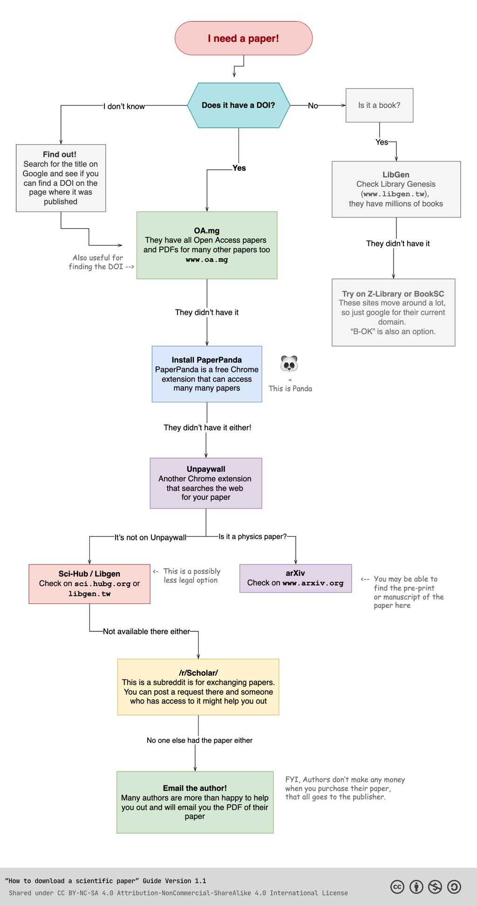

# Zotadata

A Zotero plugin that enhances your research workflow with intelligent metadata discovery and automated file management.

**⚠️ This version is specifically designed for Zotero 7.x and will not work with Zotero 6.x**

## Features

### 🔍 Intelligent Reference Management
- **Attachment Validation**: Automatically detect and remove broken file links while preserving valid PDFs and weblinks
- **Smart Cleanup**: Bulk processing to maintain clean, working attachments across your library

### 📚 Advanced Metadata Discovery
- **Multi-API Metadata Fetching**: Comprehensive metadata updates using 6+ APIs (CrossRef, OpenAlex, Semantic Scholar, OpenLibrary, Google Books, DBLP)
- **Automatic DOI/ISBN Discovery**: Find missing identifiers through intelligent title and author matching
- **Support for Multiple Item Types**: Journal articles, conference papers, preprints, and books
- **Fallback Strategies**: Multiple search approaches when primary methods fail

### 📄 Comprehensive PDF Retrieval
- **Multi-Source File Search**: Access content from 8+ sources including:
  - **Open Access**: Unpaywall, CORE, Internet Archive
  - **Preprint Servers**: arXiv with high reliability
  - **Academic Repositories**: Library Genesis, Sci-Hub
  - **Custom Resolvers**: Multiple mirror support with automatic fallback
- **Smart Download Logic**: Only downloads when needed, avoids duplicates
- **Stored File Creation**: All downloads create local stored files (never links)

<details>
<summary>Retrieval Flow Diagram</summary>

The retrieval flow is based on the following diagram:



This diagram was inspired by [this Reddit post](https://www.reddit.com/r/coolguides/comments/xr7dr0/how_to_get_scientific_papers_for_free/) about accessing scientific papers.

</details>

### 🧬 arXiv & Preprint Intelligence
- **Published Version Discovery**: Automatically find journal publications of arXiv preprints
- **Smart Type Conversion**: Convert arXiv journal articles to proper preprint format
- **Version Management**: Handle transitions from preprint to published versions
- **Metadata Synchronization**: Update bibliographic information when published versions are found

### ⚡ Efficient Batch Operations
- **Concurrent Processing**: Handle multiple items simultaneously with intelligent rate limiting
- **Progress Tracking**: Real-time progress dialogs for large batch operations
- **Error Resilience**: Continue processing even when individual items fail
- **Detailed Reporting**: Comprehensive success/failure summaries with actionable insights

### 🛠️ User Experience
- **One-Click Access**: Right-click context menu integration
- **Email Configuration**: Simple setup for API access requirements
- **Minimal Configuration**: Works out-of-the-box with optional email for enhanced features
- **Multilingual Support**: English and Chinese locales included

## Installation

### From XPI File (Zotero 7.x)

1. Download the latest release XPI file
2. In Zotero 7, go to `Tools` → `Add-ons`
3. Click the gear icon and select "Install Add-on From File..."
4. Select the downloaded XPI file
5. Restart Zotero

**Note**: This extension requires Zotero 7.0 or later. For Zotero 6.x compatibility, use an earlier version of this extension.

### Manual Installation (Development)

1. Clone or download this repository
2. Run `./build.sh` to create the XPI package
3. Install as described above

## Configuration

1. Right-click on any item in your Zotero library
2. Select `Zotadata` → `Configure Email`
3. Enter your email address (required for Unpaywall API)

**Note**: Your email is stored locally in Zotero preferences and only used for API requests to services like Unpaywall. The plugin will prompt you for an email the first time you use features that require it.

## Usage

### Context Menu

Right-click on selected items in your Zotero library to access:

- **Validate References**: Check and clean up attachments for selected items - removes broken file links while preserving valid PDFs and weblinks
- **Update Metadata**: Fetch and update metadata for journal articles, conference papers, preprints, and books using multiple APIs (CrossRef, OpenAlex, Semantic Scholar, OpenLibrary, Google Books) - can auto-discover missing DOIs/ISBNs
- **Retrieve Files**: Search and download missing PDF files from multiple sources (Unpaywall, arXiv, CORE, Library Genesis, Sci-Hub, Internet Archive) - only processes items without existing PDFs
- **Process Preprints**: Handle arXiv papers by finding published versions, updating metadata, downloading published PDFs, or converting to proper preprint format when no published version exists

### Batch Operations

Select multiple items to process them all at once. A progress dialog will show the status of each operation.

## Success Rates & Expectations

### PDF Retrieval Reality

File retrieval success varies significantly by source type:

**High Success Rate:**
- **arXiv Preprints**: Very reliable due to arXiv's open access mandate and stable infrastructure
- **Open Access Articles**: Good success via Unpaywall for legitimately open access content

**Moderate to Low Success Rate:**
- **Paywalled Journal Articles**: More challenging due to publisher restrictions and legal considerations
- **Books**: Particularly difficult to obtain, especially recent publications
- **Recent Papers**: Sci-Hub has significantly reduced new uploads due to ongoing legal challenges

### Alternative Workflows

For difficult-to-find content, consider these community-recommended approaches:

1. **Anna's Archive**: A promising source with about 5-minute wait time for link generation, but it is free.
2. **Google**: Google is always our friend as the resource might be shared in reddit, github or some niche forums.

**Note**: This plugin automates the search across legitimate and widely-used academic sources. For content not available through these channels, manual research through additional academic resources may be necessary.

## API Integration

This plugin integrates with several external APIs and services:

### Metadata APIs

#### CrossRef API
- **Purpose**: Fetch metadata for DOIs
- **Rate Limit**: 50 requests/second (polite pool)
- **Authentication**: None required (email recommended)

#### OpenAlex API
- **Purpose**: Comprehensive academic work metadata and DOI discovery
- **Rate Limit**: Very generous, no authentication required
- **Authentication**: None required

#### Semantic Scholar API
- **Purpose**: AI-powered paper search and metadata
- **Rate Limit**: Reasonable limits for academic use
- **Authentication**: None required

#### OpenLibrary & Google Books APIs
- **Purpose**: Book metadata and ISBN discovery
- **Rate Limit**: Standard API limits
- **Authentication**: None required for basic use

### PDF Sources

#### Unpaywall API
- **Purpose**: Find open access PDF links
- **Rate Limit**: 100,000 requests/day
- **Authentication**: Email address required

#### arXiv API
- **Purpose**: Search and download arXiv papers
- **Rate Limit**: 3 seconds between requests
- **Authentication**: None required

#### CORE API
- **Purpose**: Search academic papers for full-text access
- **Rate Limit**: 10,000 requests/month (free tier)
- **Authentication**: API key required for higher limits (Not implemented yet)

#### Library Genesis
- **Purpose**: Academic paper and book repository
- **Rate Limit**: Subject to site availability
- **Authentication**: None required

#### Sci-Hub
- **Purpose**: Academic paper access service
- **Rate Limit**: Subject to site availability and blocking
- **Authentication**: None required

#### Internet Archive
- **Purpose**: Open access books and historical documents
- **Rate Limit**: Standard API limits
- **Authentication**: None required

## File Structure

```
zotero-zotadata/
├── manifest.json            # Plugin metadata (Zotero 7 format)
├── bootstrap.js             # Plugin bootstrap for Zotero 7
├── prefs.js                 # Default preferences
├── assets/                  # Documentation assets
│   ├── images/             # Screenshots and diagrams
│   └── workflows/          # Workflow diagrams and flowcharts
├── content/
│   └── zotadata.js          # Main logic
├── chrome/content/
│   ├── preferences.xul      # Settings dialog
│   └── progress.xul         # Progress window
├── locale/
│   ├── en-US/               # English translations
│   └── zh-CN/               # Chinese translations
├── skin/default/
│   └── zotadata.css         # Styles
└── README.md                # This file
```

## Development

### Requirements

- Zotero 7.0 or later
- Firefox 115+ based platform

### Building

1. Make changes to the source files
2. Run `./build.sh` to create XPI package
3. Test in Zotero 7 development environment

### Testing

- Unit test the API integration functions
- Test with various item types and DOI formats
- Verify UI responsiveness and error handling
- Test with both Zotero 7 stable and beta versions

## Zotero 7 Migration

This version has been completely rewritten for Zotero 7 compatibility:

- **Extension Format**: Migrated from `install.rdf` to `manifest.json`
- **Architecture**: Changed from XUL overlays to bootstrapped extension
- **APIs**: Updated to use Zotero 7 compatible APIs
- **Window Management**: Adapted to new Zotero 7 window lifecycle
- **Preferences**: Moved to root-level `prefs.js` file

## Zotero 7 Compatibility Notes

When developing this plugin for Zotero 7, ensure the following in your `manifest.json`:

- **`manifest_version`**: Must be set to `2`. Despite Zotero 7 being based on a newer Firefox core that uses Manifest V3 for web extensions, Zotero's own bootstrapped plugins still expect `manifest_version: 2`.
- **`applications` key**: Zotero-specific properties (like `id`, `strict_min_version`, `strict_max_version`, and `update_url`) must be within an `applications.zotero` object.
- **`update_url`**: This field within `applications.zotero` is **mandatory** for Zotero 7.0.15+ (and possibly earlier Zotero 7 versions). Even for local development, a placeholder URL (e.g., `"https://example.com/update.json"`) must be provided, otherwise the plugin installation will fail with an "Extension is invalid" error.

Failure to include `update_url` will result in an error message in the Zotero debug log similar to:
`ERROR Loading extension 'your-plugin-id@example.org': Reading manifest: applications.zotero.update_url not provided`

## Contributing

1. Fork the repository
2. Create a feature branch
3. Make your changes
4. Test thoroughly with Zotero 7
5. Submit a pull request

## License

This project is licensed under the MIT License - see the LICENSE file for details.