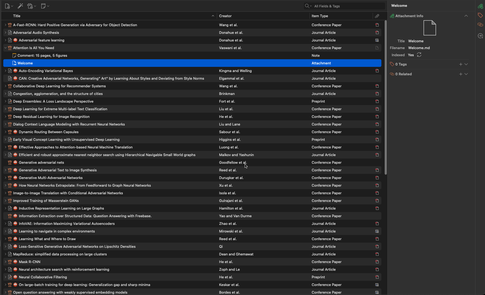
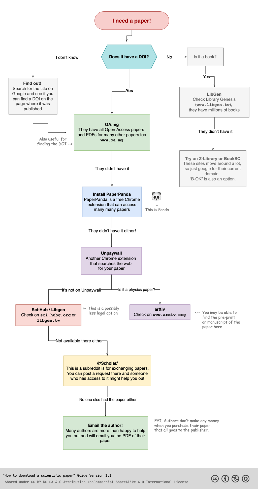

# Zotadata

A Zotero plugin that enhances your research workflow with intelligent metadata discovery and automated file management.

**⚠️ This version is designed for Zotero 8.x and 9.x**

## Demo



## Features

### 🔍 Intelligent Reference Management

- **Attachment Validation**: Automatically detect and remove broken file links while preserving valid PDFs and weblinks
- **Smart Cleanup**: Bulk processing to maintain clean, working attachments across your library

### 📚 Advanced Metadata Discovery

- **Multi-API Metadata Fetching**: Comprehensive metadata updates using 6+ APIs (CrossRef, OpenAlex, Semantic Scholar, OpenLibrary, Google Books, DBLP)
- **Automatic DOI/ISBN Discovery**: Find missing identifiers through intelligent title and author matching
- **Support for Multiple Item Types**: Journal articles, conference papers, preprints, and books
- **Fallback Strategies**: Multiple search approaches when primary methods fail

### 📄 Comprehensive PDF Retrieval

- **Multi-Source File Search**: Access content from 8+ sources including:
  - **Open Access**: Unpaywall, CORE, Internet Archive
  - **Preprint Servers**: arXiv with high reliability
  - **Academic Repositories**: Library Genesis, Sci-Hub
  - **Custom Resolvers**: Multiple mirror support with automatic fallback
- **Smart Download Logic**: Only downloads when needed, avoids duplicates
- **Stored File Creation**: All downloads create local stored files (never links)

<details>
<summary>Retrieval Flow Diagram</summary>

The retrieval flow is based on the following diagram:



This diagram was inspired by [this Reddit post](https://www.reddit.com/r/coolguides/comments/xr7dr0/how_to_get_scientific_papers_for_free/) about accessing scientific papers.

</details>

### 🧬 arXiv & Preprint Intelligence

- **Published Version Discovery**: Automatically find journal publications of arXiv preprints
- **Smart Type Conversion**: Convert arXiv journal articles to proper preprint format
- **Version Management**: Handle transitions from preprint to published versions
- **Metadata Synchronization**: Update bibliographic information when published versions are found

### ⚡ Efficient Batch Operations

- **Concurrent Processing**: Handle multiple items simultaneously with intelligent rate limiting
- **Progress Tracking**: Real-time progress dialogs for large batch operations
- **Error Resilience**: Continue processing even when individual items fail
- **Detailed Reporting**: Comprehensive success/failure summaries with actionable insights

### 🛠️ User Experience

- **One-Click Access**: Right-click context menu integration
- **Email Configuration**: Simple setup for API access requirements
- **Minimal Configuration**: Works out-of-the-box with optional email for enhanced features
- **Multilingual Support**: English and Chinese locales included

## Installation

### From XPI File (Zotero 8.x/9.x)

1. Download the latest release XPI file
2. In Zotero 8/9, go to `Tools` → `Add-ons`
3. Click the gear icon and select "Install Add-on From File..."
4. Select the downloaded XPI file
5. Restart Zotero

**Note**: This extension requires Zotero 8.0 or later. For Zotero 7.x compatibility, use an earlier version of this extension.

### Manual Installation (Development)

1. Clone or download this repository
2. Install dependencies: `npm install`
3. Build the XPI: `npm run build`
4. The XPI will be created at `.scaffold/dist/zotadata.xpi`
5. Install as described above

## Configuration

Access Settings by:

1. Right-click on any item in your Zotero library
2. Select `Zotadata` → `Settings`

### API Configuration

- **Email for Unpaywall API**: Required for Unpaywall access
  - Stored locally in Zotero preferences
  - Only used for API requests, never shared
- **CORE API Key**: Optional key for higher rate limits

### PDF Download Sources

#### Sci-Hub (Optional)

⚠️ **Important**: Sci-Hub provides access to papers that may not be legally available in your jurisdiction. Use responsibly and in accordance with local laws and institutional policies.

**Features**:

- **Enable/Disable**: Toggle to allow Sci-Hub as a fallback source (disabled by default)
- **Fallback Position**: Only tried after legitimate sources (Unpaywall, arXiv, CORE) fail
- **Error Handling**: Automatically disables after configured number of failures (default: 2)
- **Mirror Discovery**: Automatically finds working mirrors via sci-hub.pub

**Settings**:

- Max attempts before fallback (1-3, default: 2)
- Global setting persists until manually changed

**By enabling Sci-Hub, you acknowledge**:

- Understanding of potential legal implications
- Responsibility for compliance with local regulations
- Use for legitimate research purposes only

The plugin will always prioritize legal sources before attempting Sci-Hub.

**Note**: Your email is stored locally and only used for API requests to services like Unpaywall. The plugin will prompt you for an email the first time you use features that require it.

## Usage

### Context Menu

Right-click on selected items in your Zotero library to access:

- **Validate References**: Check and clean up attachments for selected items - removes broken file links while preserving valid PDFs and weblinks
- **Update Metadata**: Fetch and update metadata for journal articles, conference papers, preprints, and books using multiple APIs (CrossRef, OpenAlex, Semantic Scholar, OpenLibrary, Google Books) - can auto-discover missing DOIs/ISBNs
- **Retrieve Files**: Search and download missing PDF files from multiple sources (Unpaywall, arXiv, CORE, Library Genesis, Sci-Hub, Internet Archive) - only processes items without existing PDFs
- **Process Preprints**: Handle arXiv papers by finding published versions, updating metadata, downloading published PDFs, or converting to proper preprint format when no published version exists

### Batch Operations

Select multiple items to process them all at once. A progress dialog will show the status of each operation.

## Metadata Fetching

### Metadata Matching

The plugin uses strict matching criteria to ensure correct metadata:

1. **Exact Title Match**: Requires exact title match (with abbreviation expansion like nets→networks, ml→machine learning)
2. **Author Overlap**: Validates that search results share authors with the item
3. **Author Count Similarity**: Rejects matches with drastically different author counts
4. **arXiv Fallback**: Falls back to arXiv DOI when published DOI not found

This prevents weak/partial matches (e.g., "GAN" matching unrelated papers, or quantum ML papers matching adversarial ML papers) from overwriting correct metadata.

For best results, ensure your items have:

- Complete author lists (not just first author)
- Accurate title
- Publication year
- arXiv ID in Extra field (format: `arXiv: XXXX.XXXXX`)

### Example: "Generative Adversarial Nets"

This famous paper has multiple versions and even other papers with identical titles. The plugin correctly identifies it by:

1. Exact title match with abbreviation expansion
2. Matching multiple authors (Goodfellow, Bengio, etc.)
3. Falling back to arXiv DOI (10.48550/arxiv.1406.2661) if published DOI not found

Weak matches like "GAN" or papers with similar titles but different authors are rejected.

### Update Metadata Best Practices

When using the **Update Metadata** feature:

- **DOI is Critical**: The feature heavily relies on a correct DOI for accurate metadata retrieval. If the DOI is missing or incorrect, results may be unreliable.
- **Authors are Replaced**: New authors from metadata will replace existing authors (non-author creators like editors are preserved).
- **Exact Title Required**: Only exact title matches will update metadata, preventing incorrect matches.

### Book Metadata Fetching

Books work differently from journal articles. The plugin handles books through:

#### ISBN Discovery

1. **Existing ISBN Check**: First checks if the book already has an ISBN field
2. **Title-based Discovery**: If no ISBN, searches OpenLibrary and Google Books by exact title
3. **Author Validation**: Uses 60% author overlap threshold to validate discovered metadata
4. **ISBN Preference**: Prefers ISBN-13 over ISBN-10 for better compatibility

#### Metadata Sources

Books use three metadata sources in priority order:

1. **Zotero Translator**: Built-in Zotero book translator (most accurate)
2. **OpenLibrary API**: Comprehensive book metadata database
3. **Google Books API**: Fallback source with industry identifiers

#### Author Mismatch Detection

When applying book metadata, the plugin validates author overlap:

- **40% Threshold**: Requires at least 40% of local authors to match fetched authors when both have author data
- **Validation Logic**: Only validates when both item and fetched data have authors; if overlap < 40%, metadata is NOT applied (match rejected)
- **No Authors Case**: If item or fetched data has no authors, validation is skipped and metadata is accepted

Example:

- Local book: "Design Patterns" with authors [Gamma, Johnson]
- Fetched: "Design Patterns" with authors [Gamma, Johnson, Helm, Vlissides]
- Overlap: 2/4 = 50% >= 40% → Metadata applied successfully
- Another example: Local book with authors [Smith], fetched with authors [Johnson, Williams]
  - Overlap: 0/2 = 0% < 40% → Metadata rejected, progress window shows: "Failed: Book Title - Author mismatch (0.00 overlap)"

#### Recommended Workflow for Books

1. **Start with Title**: Books work best with accurate title
2. **Add ISBN if Available**: ISBN provides the most accurate metadata match
3. **Check Progress Window**: Review failure reasons for failed items in progress window

#### Progress Tracking

For batch book metadata operations (2+ items):

- **Progress Window**: Shows real-time status for each book
- **ISBN Display**: Shows discovered ISBN: "Design Patterns (ISBN: 9780201633610)"
- **Success/Failure**: Displays success count and failed items with errors
- **Click to Close**: Window stays open if failures exist (auto-close on all success)

#### Failure Reasons

The progress window shows detailed failure reasons for failed items:

- **Author mismatch**: "Failed: {title} - Author mismatch ({overlap}% overlap)"
- **No ISBN found**: "Failed: {title} - No ISBN found"
- **Book API failed**: "Failed: {title} - Book API failed"
- **Network errors**: "Failed: {title} - Network error"

This allows you to quickly identify why specific items failed and take appropriate action.

## Success Rates & Expectations

### PDF Retrieval Reality

File retrieval success varies significantly by source type:

**High Success Rate:**

- **arXiv Preprints**: Very reliable due to arXiv's open access mandate and stable infrastructure
- **Open Access Articles**: Good success via Unpaywall for legitimately open access content

**Moderate to Low Success Rate:**

- **Paywalled Journal Articles**: More challenging due to publisher restrictions and legal considerations
- **Books**: Particularly difficult to obtain, especially recent publications
- **Recent Papers**: Sci-Hub has significantly reduced new uploads due to ongoing legal challenges

### Alternative Workflows

For difficult-to-find content, consider these community-recommended approaches:

1. **Anna's Archive**: A promising source with about 5-minute wait time for link generation, but it is free.
2. **Google**: Google is always our friend as the resource might be shared in reddit, github or some niche forums.

**Note**: This plugin automates the search across legitimate and widely-used academic sources. For content not available through these channels, manual research through additional academic resources may be necessary.

## API Integration

This plugin integrates with several external APIs and services:

### Metadata APIs

#### CrossRef API

- **Purpose**: Fetch metadata for DOIs
- **Rate Limit**: 50 requests/second (polite pool)
- **Authentication**: None required (email recommended)

#### OpenAlex API

- **Purpose**: Comprehensive academic work metadata and DOI discovery
- **Rate Limit**: Very generous, no authentication required
- **Authentication**: None required

#### Semantic Scholar API

- **Purpose**: AI-powered paper search and metadata
- **Rate Limit**: Reasonable limits for academic use
- **Authentication**: None required

#### OpenLibrary & Google Books APIs

- **Purpose**: Book metadata and ISBN discovery
- **Rate Limit**: Standard API limits
- **Authentication**: None required for basic use

### PDF Sources

#### Unpaywall API

- **Purpose**: Find open access PDF links
- **Rate Limit**: 100,000 requests/day
- **Authentication**: Email address required

#### arXiv API

- **Purpose**: Search and download arXiv papers
- **Rate Limit**: 3 seconds between requests
- **Authentication**: None required

#### CORE API

- **Purpose**: Search academic papers for full-text access
- **Rate Limit**: 10,000 requests/month (free tier)
- **Authentication**: API key optional for higher rate limits

#### Library Genesis

- **Purpose**: Academic paper and book repository
- **Rate Limit**: Subject to site availability
- **Authentication**: None required

#### Sci-Hub

- **Purpose**: Academic paper access service
- **Rate Limit**: Subject to site availability and blocking
- **Authentication**: None required

#### Internet Archive

- **Purpose**: Open access books and historical documents
- **Rate Limit**: Standard API limits
- **Authentication**: None required

## File Structure

```
zotero-zotadata/
├── src/                         # TypeScript source code
│   ├── apis/                    # External API integrations (CrossRef, OpenAlex, etc.)
│   ├── core/                    # Core utilities, types, error management
│   ├── features/                # Feature modules (attachment, metadata)
│   ├── modules/                 # Feature modules (MetadataFetcher, ArxivProcessor)
│   ├── services/                # Shared services (Cache, Download, API)
│   ├── shared/                  # Shared utilities and core components
│   ├── ui/                      # UI components (Menu, Dialog, Preferences)
│   ├── utils/                   # Utility functions
│   ├── constants/               # Constants and configuration
│   ├── __tests__/               # Test files
│   ├── index.ts                 # Main plugin class
│   └── addon.ts                 # Entry point bridging to bootstrap.js
├── typings/                     # Custom TypeScript declarations
├── addon/                       # Zotero plugin scaffold
│   ├── bootstrap.js             # Plugin bootstrap for Zotero 8
│   ├── manifest.json            # Plugin metadata (Zotero 8 format)
│   └── locale/                  # Localization files (en-US, zh-CN)
├── skin/                        # Plugin assets (icons, legacy CSS)
├── assets/                      # Documentation assets
│   ├── images/                  # Screenshots and diagrams
│   └── workflows/               # Workflow diagrams and flowcharts
├── zotero-plugin.config.ts      # Build configuration
├── package.json                 # Node.js package config
├── tsconfig.json                # TypeScript configuration
├── AGENTS.md                    # Development guidelines and conventions
└── README.md                    # This file
```

## Development

### Requirements

- Node.js 22+ (for zotero-plugin-scaffold 0.8.x)
- Zotero 8.0 or later (supports Zotero 9.x)
- TypeScript 5.8+
- Modern IDE with TypeScript support (VS Code recommended)

### Tech Stack

| Category   | Technology                           |
| ---------- | ------------------------------------ |
| Language   | TypeScript 5.8                       |
| Runtime    | Zotero (Firefox/XULRunner)           |
| Build      | esbuild (via zotero-plugin-scaffold) |
| Testing    | Vitest                               |
| Linting    | ESLint 9 + typescript-eslint         |
| Formatting | Prettier                             |
| Types      | zotero-types, @types/node            |
| Toolkit    | zotero-plugin-toolkit                |

### Setup

1. Clone the repository
2. Install dependencies: `npm install`
3. Make your changes in the `src/` directory (TypeScript only)

### Available Scripts

```bash
npm install           # Install dependencies
npm run build         # Build the XPI package and run type-check
npm run build:dev     # Build in development mode (with source maps)
npm run type-check    # Run TypeScript type checking
npm run lint:check    # Check code style with Prettier and ESLint
npm run lint:fix      # Auto-fix code style issues
npm test              # Run unit tests with Vitest
npm run test:watch    # Run tests in watch mode
npm run test:coverage # Run tests with coverage report
npm run test:live     # Run integration tests with live APIs
npm start             # Development server with hot reload
```

### Code Style

This project follows strict TypeScript standards:

- **Strict type annotations** for all function parameters and return types
- **No `any` types** - use `unknown` with proper type guards
- **Path aliases**: `@/core`, `@/modules`, `@/services`, `@/utils`, `@/apis`, `@/ui`
- **Naming conventions**:
  - PascalCase: Classes, types, interfaces, enums
  - camelCase: Variables, functions, methods
  - UPPER_SNAKE_CASE: Constants, enum values
- **Styling**: Tailwind CSS (no raw CSS files)
- **Async patterns**: Prefer `async/await` over `.then()` chains

See `AGENTS.md` for detailed development guidelines.

### Testing

The project uses Vitest for testing:

```bash
npm test              # Run all unit tests
npm run test:watch    # Watch mode for development
npm run test:coverage # Generate coverage report
npm run test:live     # Integration tests with real APIs
```

Test structure:

- `src/__tests__/unit/` - Unit tests for individual components
- `src/__tests__/integration/` - Integration tests with live APIs
- `src/__tests__/setup.ts` - Test setup and mock configurations

### Development Workflow

1. **Type-check frequently**: Run `npm run type-check` to catch TypeScript errors early
2. **Lint before commits**: Run `npm run lint:check` to ensure code style compliance
3. **Write tests**: Add tests in `src/__tests__/` for new functionality
4. **Build and test**: Run `npm run build` before testing in Zotero
5. **Use hot reload**: Run `npm start` for active development with automatic rebuilding

### IDE Setup (VS Code)

Recommended extensions:

- TypeScript and JavaScript Language Features (built-in)
- ESLint
- Prettier
- Vitest

Configure path aliases in your IDE to recognize `@/*` imports for better navigation and IntelliSense.

### Development with Hot Reload

For active development, use the development server:

```bash
npm start  # Starts Zotero with the plugin and watches for changes
```

This will:

- Build the plugin in development mode
- Launch Zotero with the plugin loaded
- Automatically rebuild and reload when files change

## Zotero 8/9 Compatibility

This version supports both Zotero 8 and Zotero 9:

- **Module System**: Bootstrap updated to use ESM modules (`ChromeUtils.importESModule`)
- **Services Import**: Uses `resource://gre/modules/Services.sys.mjs` instead of JSM
- **Target Platform**: Built for Firefox 140+ (Zotero 8) and Firefox 115+ (Zotero 9)
- **Build System**: Uses `zotero-plugin-scaffold` 0.8.6 for modern Node.js support
- **Version Constraints**: `strict_min_version: "8.0"` and `strict_max_version: "9.*"`

### Key Changes from Zotero 7

1. **Bootstrap.js**: Updated from JSM to ESM imports
2. **File Structure**: Plugin files moved to `addon/` directory for scaffold compatibility
3. **Build Tool**: Replaced `build.sh` with `zotero-plugin-scaffold` npm package
4. **Node.js Requirement**: Now requires Node.js 22+ (was 18+)

### Architecture Improvements (v1.4.0)

1. **Modular Design**: MetadataFetcher refactored into separate services:
   - `DOIDiscoveryService` - DOI search across multiple APIs
   - `BookMetadataService` - ISBN and book metadata handling
   - `MetadataUpdateService` - Field update operations
2. **Dependency Injection**: Services can be injected for testing
3. **Utility Modules**: Shared utilities for ISBN, similarity, and field operations
4. **Rate Limit Optimization**: Proper API call ordering with delays

## Contributing

1. Fork the repository
2. Create a feature branch
3. Make your changes
4. Test thoroughly with Zotero 8
5. Submit a pull request

## License

This project is licensed under the MIT License - see the LICENSE file for details.
